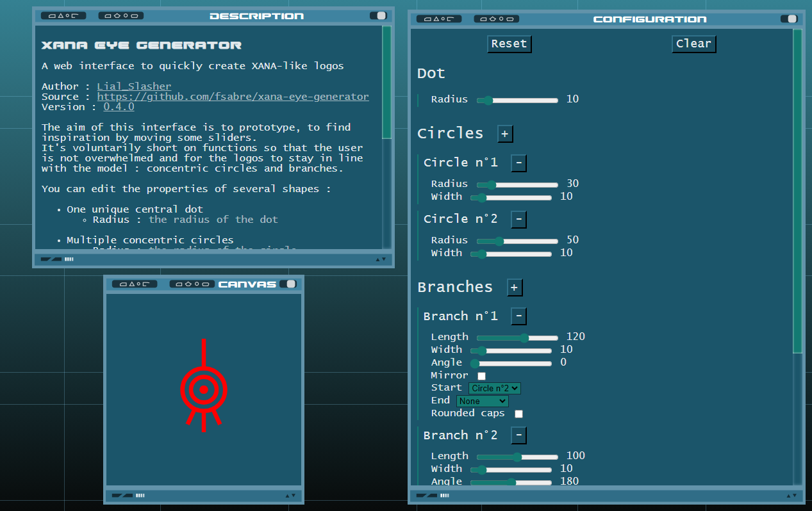
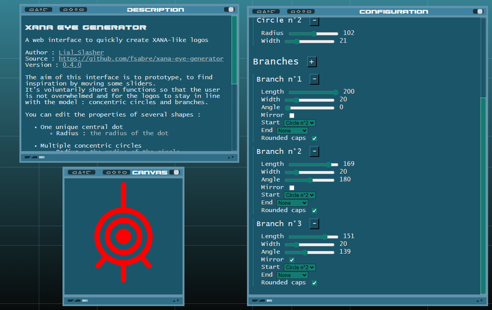
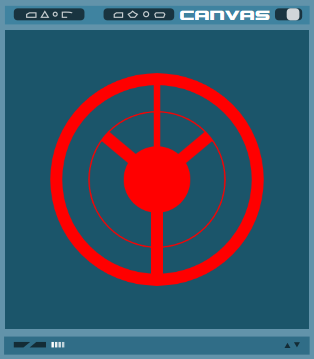
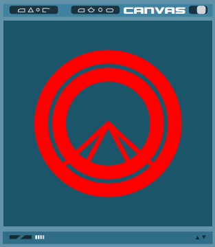
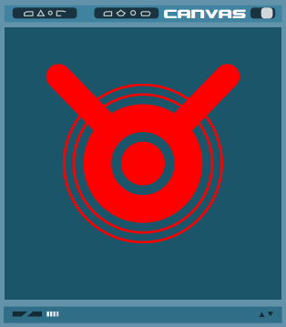
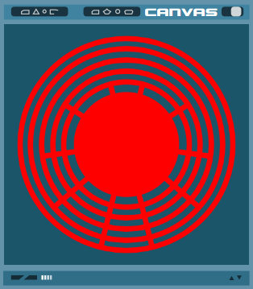

# XANA-Eye-Generator

A web interface to quickly create XANA-like logos.

The aim of this interface is to prototype, to find inspiration by moving some sliders. It's voluntarily short on
functions so that the user is not overwhelmed and for the logos to stay in line with the model : concentric circles and
branches.

Made with TypeScript, React, Vite and HTML canvas.

## Demo

Try it on [fsabre.github.io/xana-eye-generator](https://fsabre.github.io/xana-eye-generator/).

## Screenshots

The startup interface :



The interface and a modified XANA eye :



Some examples of created logos :

<div style="margin-top: 10px; display: flex; flex-direction: row; justify-content: center; gap: 10px; flex-wrap: wrap">




</div>

## Usage

You can edit the properties of several shapes :

- One unique central dot

    + Radius : the radius of the dot

- Multiple concentric circles

    + Radius : the radius of the circle
    + Width : the width of the line

- Multiple branches aligned with the center

    + Length : the distance between the center and the end of the branch
    + Width : the width of the line
    + Angle : the angle of the branch. In degrees, clockwise, 0° is upwards.
    + Mirror : whether to mirror the branch along the X axis
    + Start : whether to snap the start of the branch to a circle
    + End : whether to snap the end of the branch to a circle
    + Rounded caps : whether to use rounded or flat ends

Click the `RESET` button to restore the default logo.

Click the `CLEAR` button to clear the canvas.

Click the `EXPORT` button to export your logo as SVG.

## Run Locally

To test this project on your own computer, run

```bash
  git clone https://github.com/fsabre/xana-eye-generator.git
  cd xana-eye-generator
  yarn
  yarn dev
```

# TODO

See [TODO.md](./TODO.md).
